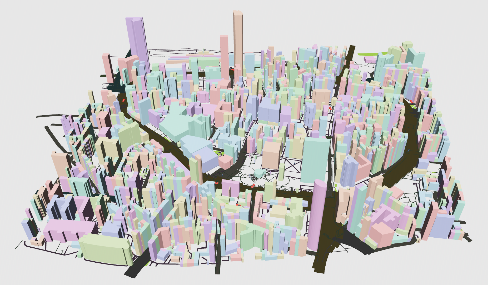

# 3D City Loader

Joint project with [@DukeBas](https://github.com/DukeBas) and [@w2ptr](https://github.com/w2ptr).

In this project, we created a 3D city loader that can load cities from the OpenStreetMap database and display them in a 3D environment. The project is written in Rust and uses the Bevy game engine for rendering. It can be run as a native application or as a web application.

## Demo
[You can play around with our tool here](https://archimedesftw.github.io/3d-city-loader/)


*A picture of a part of Nijmegen. Generated using the web version of our tool.*


### Web Controls
On the web version, the controls are the same as the native version:
- W, A, S, D for moving forward, left, backward, right respectively;
- The `Spacebar` and `Shift` keys are used for moving the camera up and down respectively.
- The mouse is used for rotating the camera.
- Press `Tab` to enter the city name, and `Enter` to load the city.	
Click on the game again, to prevent typing in the city name.

_Note: The city name is case-sensitive. (e.g "Netersel" or "Berlin")._
### Troubleshooting

- **When loading a city, it seems to do nothing**
  - *Solution*: The game is working, but it takes a while to load the city using the free Overpass API; The UI will confirm once it's fully loaded.

- **The mouse does not work well (e.g. the mouse leaving the game window)**
  - *Solution*: Press `Esc` **twice**, then click on the game again.

- **File selection and API doesn't work**
  - *Solution*: This feature is only available on the native version.

- **I want more performance**
  - *Solution*: Use the native version.


## Building/Running the Project

First of all, [install `cargo`](https://doc.rust-lang.org/cargo/getting-started/installation.html).

Then run the `release` (fastest) version of the project with:

```sh
cargo run --release
```

### Controls (Native version)

Running the pre-built executable will open a window that has two parts:

- The loader panel, which is a small floating panel that can be collapsed and moved around.

- The earth panel, which takes up the full width of the screen. It can be accessed by clicking anywhere on the panel,
  and focus can be returned to the load panael by pressing the Escape button.

The loader panel has three options:

- A "City" option, which takes the name of a city like "Netersel" or "Berlin" (has to be capitalized). Pressing the
  "LOAD" button should send a request over the network to the Overpass API, which can take quite some time for large
  cities. After receiving the data, the application will display a confirmation message and create the city;

- A "File" option, which takes an absolute or relative file path to a `.json` file on the computer. One useful trick is
  that the app will store the latest query in the file `./geocache/last.json`, so entering that file here can save a
  lot of time if you are trying to load the same city as during a previous run;

- An "Overpass" option, which takes a raw OverpassQL query. Note that the output format is still expected to be JSON,
  so `[out:json];` is required at the start of the query.

The earth panel shows a first-person view of the data that was loaded, once focus is transferred to it by clicking the
panel with the mouse. The following controls can be used:

- W, A, S, D for moving forward, left, backward, right respectively;

- Spacebar and Shift for moving up and down respectively;

- Dragging the mouse or touchpad for rotating around the camera;

- Escape for transferring the focus back to the user interface (the earth loader panel).

## Running web version
> **Warning:** The web version of this project will run slower compared to the native version. This is due to the limitations of running in a web environment.

To run the web version, you first need to build the project. This can be done with the following command:

```sh	
trunk build
```

Then, you can serve the project with the following command:

```sh
trunk serve
```

### Hosting the project 


You can also host the project with any static file server, like `http-server`:

```sh
http-server -p 8080 ./dist
```
or with `python`:

```sh
python3 -m http.server 8080 --directory ./dist
```


